# Epiphyte Electronic Hardware Description

## Overview
This document serves as a reference for the electronic hardware elements of the first prototype of Epiphyte. The design evolved as it was built, and I offer suggestions for improvement or modifications as appropriate.
In the interest of brevity, it is assumed that the reader is already familiar with electronics and programming.

### Epiphyte System
The overall design of the Epiphyte system is shown in Figure 1, below, with a focus on the elements to be described in this document.
 
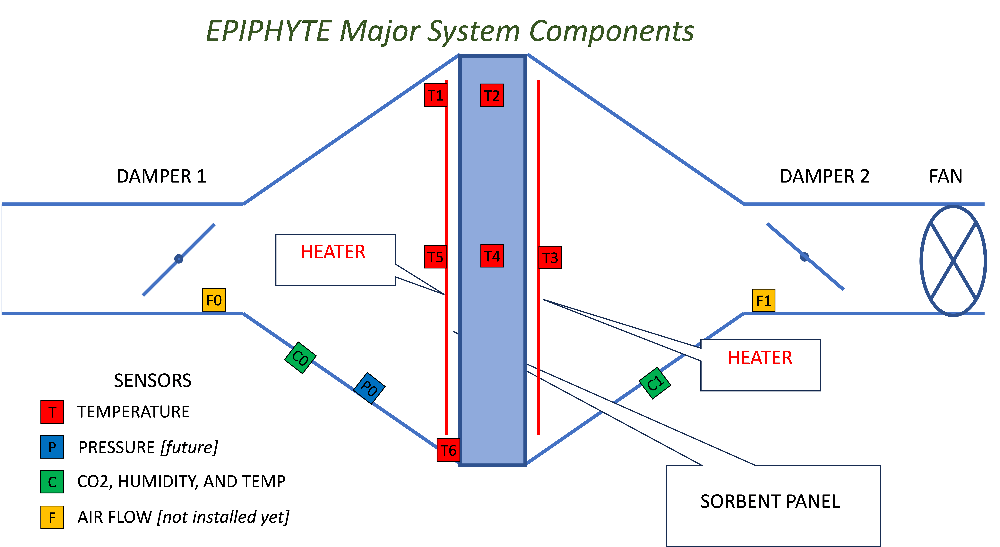

### Electronics Block Diagram
To put the detailed description that follows into context, we include a high-level block diagram of Epiphyte’s electrical circuitry. 
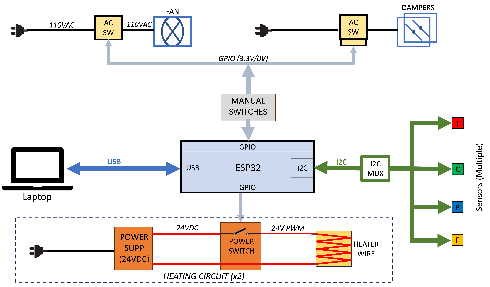

## Processor
The processor is an [Adafruit ESP32 Feather V2](https://www.adafruit.com/product/5400). Most other processors should work, as the application is not critical for speed or complex calculations. In particular, most 3.3-V processors of the Arduino or Adafruit Feather family should work with a few changes to the software. (Don’t use a 5V processor unless you know what you’re doing!) The processor also includes WiFi and Bluetooth connectivity, but these features have not been employed with Epiphyte as of this writing. They might be useful for data logging onto a server, or for remote control and monitoring of the system.

The user is urged to read and understand the information provided by Adafruit here: https://learn.adafruit.com/adafruit-esp32-feather-v2

The Feather can be programmed either in C/C++ or Python. In Epiphyte, I used C/C++.

### Pinout
Design files and pinouts for the board can be found here: https://github.com/adafruit/Adafruit-ESP32-Feather-V2-PCB/tree/main 
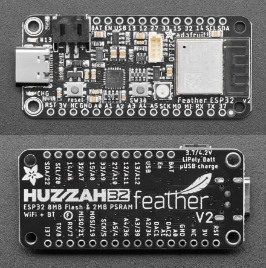 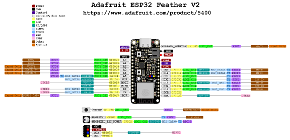

### Display
For realtime monitoring of system activity, a monochrome OLED display is provided. This [Adafruit Featherwing](https://www.adafruit.com/product/4650) can be attached to the Feather processor. All connections are made through pins without needing any additional wiring. 
Communication with the display is via I2C, and this board also includes three pushbutton switches that are connected to processor GPIO pins. These could be useful for real-time control of the system.

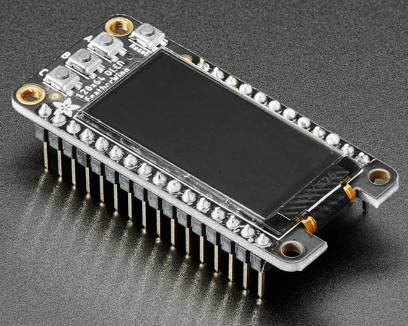

### NeoPixel
An RGB LED (“Neopixel”) is supplied on the Feather board. This LED’s color and brightness can be programmed and used as a visual indicator. The NeoPixel library handles all the programming of this device.

### Processor Pin Assignments
This table shows the GPIO pins that are used in this design. Functions are detailed in sections below.
|     Pin No    |     Signal          |     In/Out    |     Description                                           |
|---------------|---------------------|---------------|-----------------------------------------------------------|
|     0         |     NEOPIXEL_PIN    |     O         |     Serial   communication with NeoPixel                  |
|     12        |     swRUN           |     I         |     To   toggle switch: active LOW sets RUN mode          |
|     13        |     swSET           |     I         |     To   toggle switch: active LOW sets SETUP mode        |
|     14        |     BUTTON_C        |     I         |     To   OLED board pushbutton C (not used)               |
|     15        |     BUTTON_A        |     I         |     To OLED board pushbutton A (not used)                 |
|     27        |     HEAT_PWM_1      |     O         |     To Heater 1 control gate; PWM   duty-cycle control    |
|     32        |     BUTTON_B        |     I         |     To OLED board pushbutton A (not used)                 |
|     33        |     HEAT_PWM_2      |     O         |     To Heater 2 control gate; PWM   duty-cycle control    |

## I2C Connections
The sensors in Epiphyte are all connected to the processor with the [I2C](https://en.wikipedia.org/wiki/I%C2%B2C) serial bus.  It is important to note that because the processor supply and interfaces are 3.3V, any slave devices must also operate from this voltage (including pullups) to avoid damaging the processor.

### Stemma QT
[STEMMA QT](https://learn.adafruit.com/introducing-adafruit-stemma-qt/what-is-stemma-qt) is an Adafruit system for easily making I2C connections between compatible devices. Many boards come with a STEMMA QT connector, and cables of various lengths are available to connect devices simply by plugging in the cables. 
Each cable has 4 wires: Power, Ground, SDA, and SCK. Cables come in various lengths; an example is depicted below.
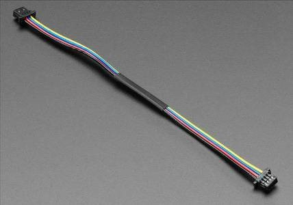

### I2C Extender
I2C signals suffer degradation with longer cables (including STEMMA QT cables). The [I2C extender](https://www.adafruit.com/product/4756) allows cascades of STEMMA QT cables or longer runs between the processor and the sensors. The LTC4311 is an IC which boosts and reshapes I2C signals, and is available from Adafruit on a breakout board with convenient STEMMA QT connectors. This device is liberally used in Epiphyte wherever longer signal runs are needed.
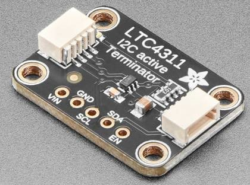

### I2C Multiplexing
Because there are multiple instances of each type of sensor, most with fixed I2C addresses, a multiplexer is necessary to disambiguate these devices for correct addressing. Adafruit makes a [breakout board](https://www.adafruit.com/product/5626) for the PCA9548 I2C multiplexer chip (shown below), which features a common port on the end and eight switched ports around two edges, all with STEMMA QT connectors.

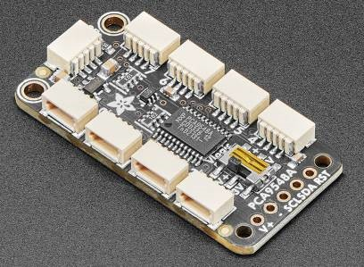

The MUX acts as a bidirectional 1-to-8 switch, and is itself an I2C device with its own address. The I2C address of the MUX can be selected with solderable jumpers on the PCB (labelled A0, A1, and A2 on the back - see image below). The position of the switch is controlled by the processor sending a formatted command. Then the MUX becomes transparent and the selected slave device can be addressed in the usual way as if it were the only one on the bus with that address. Note that the ports are numbered 0 through 7.

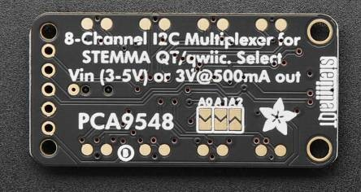

In the current embodiment of Epiphyte, two 1:8 MUXes are used, with labels as used in the software and corresponding addresses as follows:
|     MUX Label    |     MUX I2C Address    |
|------------------|------------------------|
|     MUX1         |     0x71               |
|     MUX2         |     0x72               |

The MUX addresses and port numbers of each sensor used in Epiphyte are shown in this table and in the schematic below:
|     Device              |     Part No.       |     Label    |     MUX#    |     MUX Channel    |     Device I2C Address    |     Location                             |
|-------------------------|--------------------|--------------|-------------|--------------------|---------------------------|------------------------------------------|
|     Thermocouple Amp    |     MCP9600        |     T0       |     2       |     0              |     0x67                  |     Not used                             |
|     Thermocouple Amp    |     MCP9600        |     T1       |     2       |     1              |     0x67                  |     Input side heater   wire, corner     |
|     Thermocouple Amp    |     MCP9600        |     T2       |     2       |     2              |     0x67                  |     Sorbent center, corner               |
|     Thermocouple Amp    |     MCP9600        |     T3       |     2       |     3              |     0x67                  |     Output side heater   wire, center    |
|     Thermocouple Amp    |     MCP9600        |     T4       |     2       |     4              |     0x67                  |     Sorbent center,   center             |
|     Thermocouple Amp    |     MCP9600        |     T5       |     2       |     5              |     0x67                  |     Input side heater   wire, center     |
|     Thermocouple Amp    |     MCP9600        |     T6       |     2       |     6              |     0x67                  |     Sorbent frame                        |
|     Thermocouple Amp    |     MCP9600        |     T7       |     2       |     7              |     0x67                  |     Not used                             |
|     CO2 Sensor          |     SCD30          |     C0       |     1       |     3              |     0x61                  |     Input duct                           |
|     CO2 Sensor          |     SCD30          |     C1       |     1       |     4              |     0x61                  |     Output duct                          |
|     Pressure Sensor     |     MPRLS          |     P0       |     1       |     5              |     0x18                  |     Not used (yet)                       |
|     Flow meter          |     FS1015-1005    |     F0       |     1       |     2              |     0x50                  |     Not used   (yet)                     |
|     Flow meter          |     FS1015-1005    |     F1       |     1       |     1              |     0x50                  |     Not used   (yet)                     |

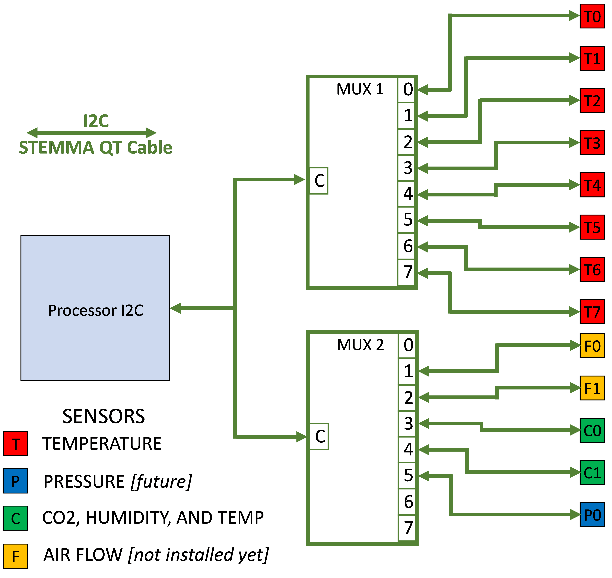
Note one simplification made in this diagram: For connecting the Airflow Sensors, which require a 5-V power supply, a Logic Level Shifter is required to shift the 3.3-V I2C levels to the 5-V system.

### Logic Level Shifter
The [logic level shifter](https://www.adafruit.com/product/757) is pretty flexible in that it can shift logic levels between any two voltages that are supplied to it. In Epiphyte, pin “LV” is connected to 3.3V, and the I2C SDA and SCL lines from the MUX that control the Airflow Sensors are connected to pins A1 through A4; “HV” is powered from 5V (from the Feather USB pin) and pins B1 through B4 go to the I2C pins of the two Airflow Sensors.
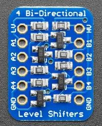

## Control Switches
A number of toggle switches are provided for manually controlling the state of the executing software and to control the fan and dampers. These switches are all SPDT (single-pole/double throw). They are connected as follows:
|     Name       |     Common            |     Term   1          |     Term   2          |     Function                                                                           |
|----------------|-----------------------|-----------------------|-----------------------|----------------------------------------------------------------------------------------|
|     POWER      |     GND               |     EN                |     N/C               |     Powers up processor                                                                |
|     RUN/SET    |     GND               |     Pin 12; pullup    |     Pin 13; pullup    |     RUN=normal system   function     SET=configure system   parameters via terminal    |
|     FAN        |     Fan   relay       |     GND               |     Pullup            |     Activates fan                                                                      |
|     DAMPER     |     Damper   relay    |     GND               |     Pullup            |     Activates   dampers                                                                |

Note: [pullups](https://en.wikipedia.org/wiki/Pull-up_resistor), where indicated, are 10kohm to 3.3V.

There is also a pushbutton connected to the processor RESET pin. This is redundant with the RESET button on the processor, but provided for ergonomic reasons.

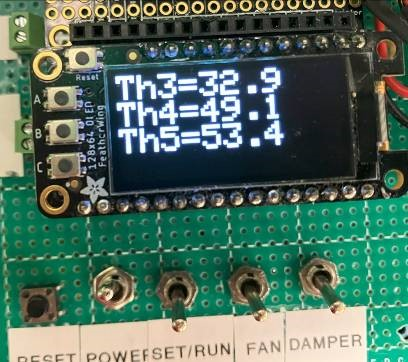.

## Heating System
Two heating systems are supplied, one for each side of the sorbent. The details of this system will vary greatly depending on the amount of heat needed by the sorbent, the location of the wires, the heat loss from parasitic conduction, and the size of the sorbent panel.

Based on estimates from various sources, I concluded that a maximum power capability of 240W for each system would be sufficient:

*P* = *D* \* *V*2/*R*

### Nichrome Wires
The wires used have a resistivity of 0.4 ohm/ft. The total length of each heater element is 6 ft, yielding a resistance of 2.4 ohm.
https://www.digikey.com/en/products/detail/remington-industries/18N8025/11612571

### Power Supply
The power supply needs to produce at least 240 W. This unit does nicely:
https://www.amazon.com/MEAN-WELL-LRS-350-24-350-4W-Switchable/dp/B013ETVO12/ref=sr_1_3
At an output voltage of 24V, the maximum current drawn by the heating wire would be 10A.
The two supplies were mounted in a closed chassis for safety:

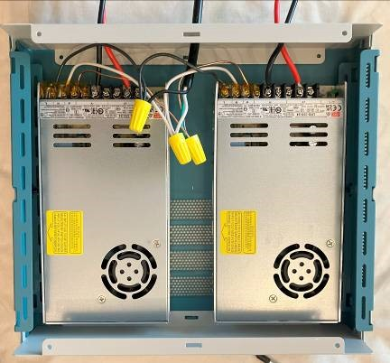.

### PWM Switching Circuit
The circuit diagram for each switching circuit is shown as an LTSpice schematic here:

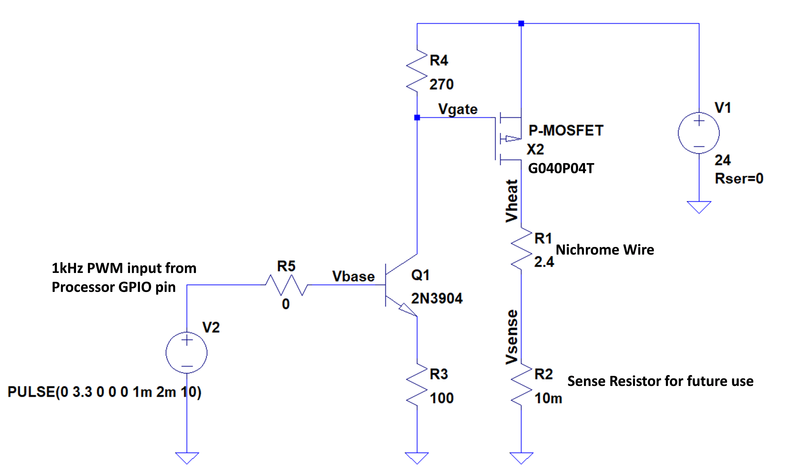

V1 represents the 24-VDC power supply; V2 is the 1-kHz PWM switching signal from the processor pin, and R1 represents the 2.4-ohm resistance of the nichrome wire. The simulation accurately predicted the performance of the actual circuit.

## Mechanical Controls
### Fan
The [fan](https://hvacquick.com/products/residential/AirFlow-Boosting/Inline-Air-Booster-Fans/AC-Infinity-CLOUDLINE-Inline-Fans-With-Speed-Controller) requires an AC power supply. A digitally controlled AC relay turns the power on or off; currently this relay is controlled by a manual toggle switch but this could also be connected to a processor GPIO pin for progam control.
The fan also has a control switch with a pushbutton to adjust the fan speed. At the time of writing, this is done manually. More research needs to be done to work out how to control the fan speed under processor control.

### Dampers
This [damper](https://hvacquick.com/products/residential/Zoning-and-Zone-Dampers/Zone-Dampers/Suncourt-Motorized-Zone-Dampers) is Normally Open. Applying 24VAC closes the flapper. A transformer is supplied to reduce the 110VAC line voltage to the correct operating level. As with the Fan, an AC relay is used to activate the dampers, also controlled by a manual switch for the time being. To save on parts, both dampers are controlled together from one switch.

### AC Relays
This [relay](https://www.amazon.com/gp/product/B00WV7GMA2/ref=ppx_yo_dt_b_asin_title_o00_s00) switches an AC line voltage between outlets under DC control. 

## Sensors
### CO2 Sensors
The Sensirion SCD30 CO2 sensor is employed in Epiphyte. It is available on a [breakout board from Adafruit](https://www.adafruit.com/product/4867), with STEMMA QT connectors.
**NOTE:** the sensor may work fine as-is, but the design of this breakout board is deficient: the SCD30 sensor requires a minimum of 3.3V for specified operation, but this board, which nominally has a 3.3V supply input from the STEMMA QT cable, actually supplies a lower voltage due to drops in the LDO and wire resistance. For reliable operation, I found it necessary to bypass the LDO, and connect the input supply and ground directly to the processor with heavier wires (22 AWG was fine).

### Temperature Sensors and Amplifiers
Two types of thermocouples were used, with no real difference between them except the shape of the sensor element:
[Thermocouple Type-K Glass Braid Insulated Stainless Steel Tip](https://www.adafruit.com/product/3245) and [Thermocouple Type-K Glass Braid Insulated - 5m](https://www.adafruit.com/product/3895)
It is important to note that the sensor end of either type of thermocouple is not electrically insulated, so if it is contacting a conductive surface, it must be insulated from it. Kapton tape works well for this.
These thermocouples respond with a very low voltage, so an amplifier is needed. The MCP9600, available on a [breakout from Adafruit](https://www.adafruit.com/product/4101), amplifies and digitizes the signal so it can be read with I2C.

### Pressure Sensors (not implemented)
We specified [pressure sensors](https://www.adafruit.com/product/3965), but at the time of writing this device has not been used. 

### Airflow Sensors
https://www.mouser.com/ProductDetail/972-FS10151005
Note: this part is shown as “obsolete” so a replacement will need to be found. 

